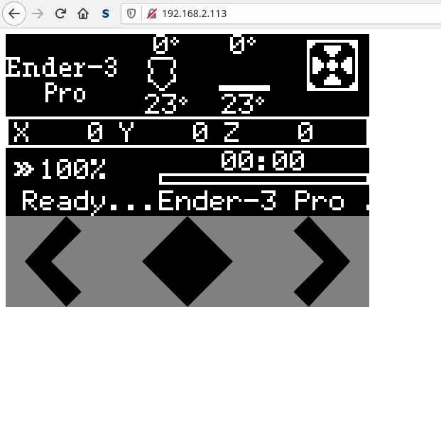

# Ender-Display-Remote-Control
Adds wifi remote control ability to stock Creality 3D Printers using an ESP32 Microcontroller

ESP32 will read and interpret SPI Messages to the Display and host a Webpage to view the content

## Prerequirements
Install esp-idf
https://docs.espressif.com/projects/esp-idf/en/latest/esp32/get-started/index.html#get-started-get-esp-idf

## Setup
clone this repository

copy example config

``cd Software``

``cp example_sdkconfig sdkconfig``

Enter your wifi credentials with

``idf.py menuconfig``

## Hardware
No Hardware modifications are nessesary. All required pins for reading SPI signals and simulating input on rotary encoder are also routed out to EXP1 and EXP2 Header.

As the Ender 3D Printers are 5V Systems and the ESP32 is running on 3.3V some extra Components are required.
All SPI signals use a voltage divider (3.3k and 6.8k) to drop the voltage level to 3.3V.
All encoder Pins are pulled up to 5V by the 3D printers MCU.
A Transistor/Mosfet is used to pull them to Ground to simulate input.
An additional resistor (1k) is used to protect Printer from high input current.

## Documentation
Ender 3 Pro uses a so called 12864 Display. The Display uses a ST7920 Driver in SPI configuration.
Display only gets written to, never read by spi (no miso connected)
CS is active high.
Most of the display driver features (like character displaying) are compleatly unused. 
The printer uses direct graphics ram manipulation to display stuff.
The printers init routine sets display to extended instruction set.
